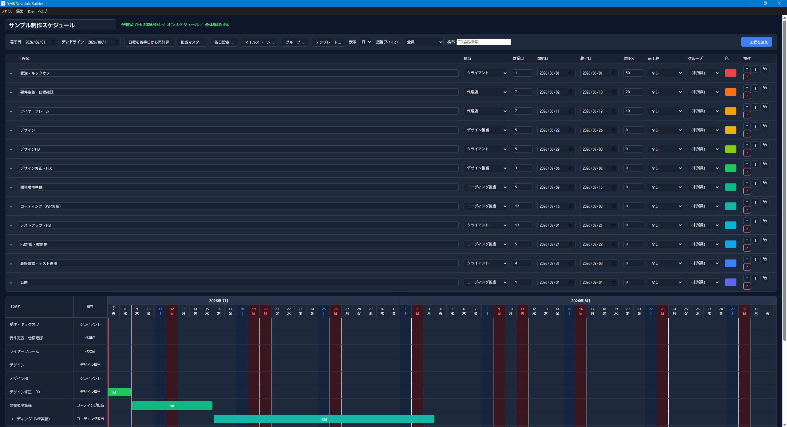

# YMB Schedule Builder

ガントチャート式スケジュール作成アプリ（Windows / macOS 対応デスクトップアプリ）。
工程・担当・営業日数を入力するだけで、ガントチャートを自動生成します。
プロジェクトファイルへの保存、Excel（横方向 / 縦方向）への出力に対応しています。



---

## 主な機能

- **ガントチャート表示強化** — 工程の開始日・終了日をリアルタイムで描画、今日マーカー表示と起動時の自動スクロール、納期超過工程の警告表示（セル・バーの色分け）に対応
- **営業日計算** — 土日・祝日を除いた営業日ベースでスケジュールを算出
- **祝日自動取得** — インターネットから日本の祝日データを取得して反映
- **担当マスタ管理** — 担当者を自由に追加・編集・削除、同一担当の期間重複を警告表示
- **工程カラー設定** — プリセット18色 + OS ネイティブカラーピッカーで色指定
- **工程の複製・依存関係** — ボタン一つで工程を複製、前工程を設定すると後続工程が営業日ベースで自動連鎖シフト（循環設定は検出）
- **工程グループ（フェーズ）管理** — フェーズ単位での折りたたみに対応し、Excel横出力にも見出し行として反映
- **検索・進捗管理** — 工程名検索（担当フィルターとの組み合わせ可）、営業日数で加重平均した全体進捗サマリを表示
- **テンプレート保存/適用** — よく使う工程構成をテンプレートとして保存し、全置換または末尾追加で呼び出し
- **Excel 出力（横方向 / 縦方向）** — 日付軸を列 or 行に展開した2種類のレイアウトで出力、横出力のExcelファイルは再インポート可能
- **最近使ったファイル・自動保存** — 直近8件を記録してメニューからすぐに開け、編集内容は自動保存され次回起動時に復元
- **ドラッグ＆ドロップ** — 工程の並び順をドラッグで変更
- **最新版チェック** — 起動時に GitHub Releases を確認し、新しいバージョンがあればダイアログで案内

---

## 開発環境のセットアップ

### 必要なもの

- [Node.js](https://nodejs.org/) LTS 版

### セットアップ（Windows）

```powershell
# 依存パッケージのインストール（Node.js が未インストールの場合は自動で導入）
.\setup.ps1

# 開発モードで起動
npm start
```

### セットアップ（macOS / Linux）

```bash
npm install
npm start
```

---

## 技術スタック

| 項目 | 内容 |
|---|---|
| フレームワーク | [Electron](https://www.electronjs.org/) v43 |
| UI | HTML / CSS / Vanilla JavaScript |
| Excel 出力 | [ExcelJS](https://github.com/exceljs/exceljs) v4 |
| ビルドツール | [electron-builder](https://www.electron.build/) v26 |
| 祝日データ | [holidays-jp.github.io](https://holidays-jp.github.io/) |

---

## ダウンロード

[Releases](../../releases) から最新版をダウンロードしてください。push 毎に GitHub Actions が自動ビルド・公開します。

### Windows

| ファイル | 説明 |
|---|---|
| `YMB Schedule Builder Setup x.x.x.exe` | インストーラ版（スタートメニュー登録） |
| `YMB Schedule Builder x.x.x.exe` | ポータブル版（インストール不要） |

> コード署名をしていないため、インストール・起動時に **Windows Defender SmartScreen** が警告を表示する場合があります。
> 「詳細情報」→「実行」を選択してください。

### macOS

| ファイル | 説明 |
|---|---|
| `YMB Schedule Builder-x.x.x.dmg` | Intel Mac 用（x64） |
| `YMB Schedule Builder-x.x.x-arm64.dmg` | Apple Silicon 用（M1 / M2 / M3） |

> macOS では初回起動時に「開発元が未確認」と表示される場合があります。
> Finder でファイルを右クリック →「開く」を選択してください。

---

## ライセンス

[MIT License](./LICENSE) © 2026 ymb
